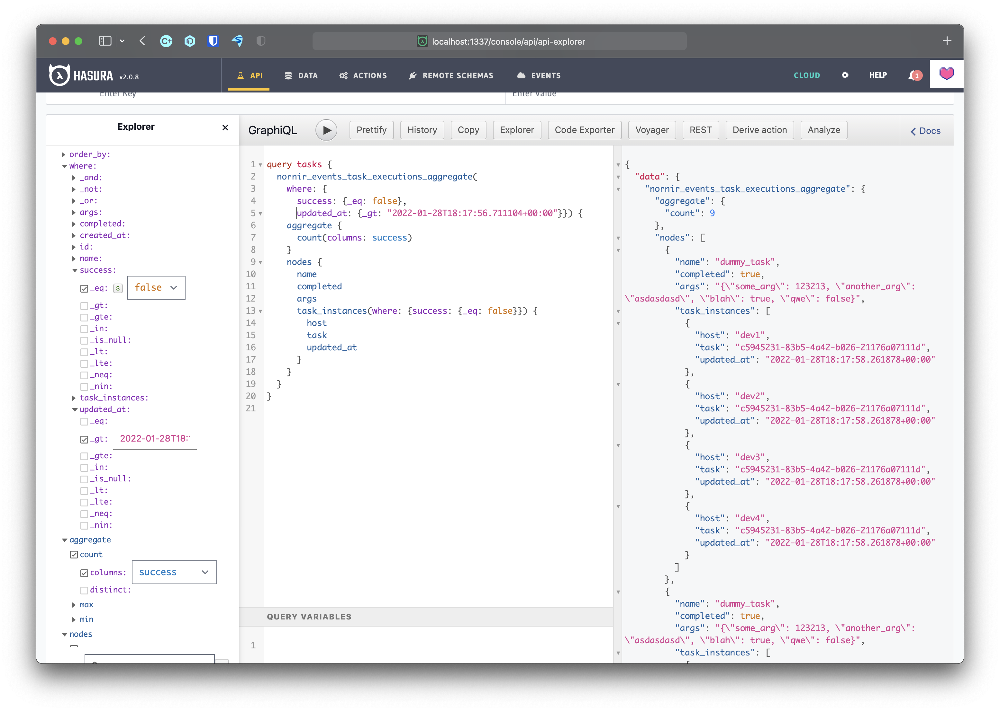

# nornir-nhost

Very early prototype of writing a set of plugins for nornir integrating with [nhost](https://nhost.io)'s BaaS offering. Why? Because it provides:

1. Fully managed postgresql with a graphql interface
2. Authentication service
3. Storage service
4. Serverless functions
5. Fully opensource, everything can be self-hosted
6. Free and paid plans

And because I work there :)

Some ideas:

1. Processor to save results in the graphql backend (in-progress)
2. Leverage the storage to save/retrieve images or any other asset needed for upgrades or any other runbooks
3. Leverage the auth service and its integration with hasura to build a simple but yet powerful RBAC system
4. Port the simple inventory to graphql
5. Others? Please, post

## Processor

This plugin does the following:

1. When a task starts it creates an entry in the backend with `success` and `completed` set to `False`, the `name` of the task and the `arguments` passed to it
2. When the task finishes it updates the backend with:
   a. For the task it sets `completed` to `True` and `success` `not results.failed`
   b. For each host it creates an entry indicating when it completed and the result


Below you can see a screenshot of me attempting to write a graphql query to build a quick report to see the tasks that failed after a given time:




## Running the demo yourself

### Requirements

You will need:

1. [nhost cli](https://github.com/nhost/cli#installation)
2. [poetry](https://python-poetry.org)

Alternatively, [nix](https://nixos.org)

### Starting the environment

If you want to try the processor you will need to start the environment first.

#### Using nix

Run `nix develop` and then `nhost`

#### Withou nix

Install the nhost cli and then run `nhost`

### Testig it out

You can either try to import the processor on your and try to use it yourself:

```
from nornir_nhost.plugins.processors import SaveToGraphql

url = "http://localhost:1337/v1/graphql"
nhost_admin_secret = "nhost-admin-secret"
processor = SaveToGraphql(url, nhost_admin_secret)
```

Or you can run the tests with `pytest -vs` several times to at least see how the data is populated and play with the web console.

### Running it in production with nhost

I will write a more thorough guide but the gist of it is:

1. Sign up with nhost
2. create a free app
3. Fork this repo
4. In nhost's web console connect your app with your repository
5. Enjoy seeing how by just connecting the repo everything is provisioned for you (magic!)
6. Replace `url` and `nhost_admin_secret` correspondingly (the web interface should tell you all that). Proper authentication with JWT will come later if there is interest in the RBAC solution.
